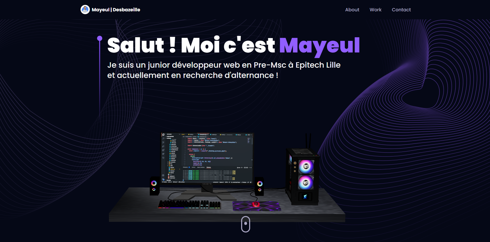

<a id="readme-top"></a>
<!-- PROJECT LOGO -->
<br />
<div align="center">
  <a href="https://github.com/Acrazie" target="_blank">
    
  </a>

  <h3 align="center">Portfolio</h3>

  <p align="center">
    My Portfolio made with React + ThreeJS
    <br />
    <a href="https://github.com/Acrazie/Portfolio"><strong>Explore the docs »</strong></a>
    <br />
    <br />
    <a href="https://mayeul-desbazeille.vercel.app/">View Site</a>
  </p>
</div>


<!-- TABLE OF CONTENTS -->
<details>
  <summary>Table of Contents</summary>
  <ol>
    <li>
      <a href="#about-the-project">About The Project</a>
      <ul>
        <li><a href="#built-with">Built With</a></li>
      </ul>
    </li>
    <li>
      <a href="#getting-started">Getting Started</a>
      <ul>
        <li><a href="#prerequisites">Prerequisites</a></li>
        <li><a href="#installation">Installation</a></li>
      </ul>
    </li>
    <li><a href="#contact">Contact</a></li>
  </ol>
</details>


<!-- ABOUT THE PROJECT -->
## About The Project

Avec ce projet, j'ai voulu d'une part exposer mes réalisations; montrer de quoi j'étais capable. Explorer la stack Three.js est l'autre part.Le projet a pris 1 à 2 semaines avec un travail journalier.

Le plus difficile a été ThreeJS et d'avoir une "clean archi" avec React, ce qui généralement est assez compliqué à mettre en place.

J'espère que vous aimez ! 😀

<p align="right">(<a href="#readme-top">back to top</a>)</p>


### Built With

<div align="center">
  
  
  
  
  
</div>

###

<p align="right">(<a href="#readme-top">back to top</a>)</p>


<!-- GETTING STARTED -->
## Getting Started

Suivez le guide d'installation et tout ira bien :)

### Prerequisites

Aucune action n’est prérequise pour cloner le repo sur votre machine !

### Installation

1. Clone the repo
   ```sh
   git@github.com:Acrazie/Portfolio.git
   ```
2. Install NPM packages
   ```sh
   npm install
   ```
3. Start the project in dev mode
   ```sh
   npm run dev
   ```

<p align="right">(<a href="#readme-top">back to top</a>)</p>

<!-- CONTACT -->
## Contact

<br clear="both">

<p align="center">
  <a href="https://www.linkedin.com/in/mayeuld/" target="_blank"></a>&nbsp;&nbsp;
  <a href="https://linktr.ee/MayeulDBZ" target="_blank"></a>&nbsp;&nbsp;
</p>

###

<p align="right">(<a href="#readme-top">back to top</a>)</p>
